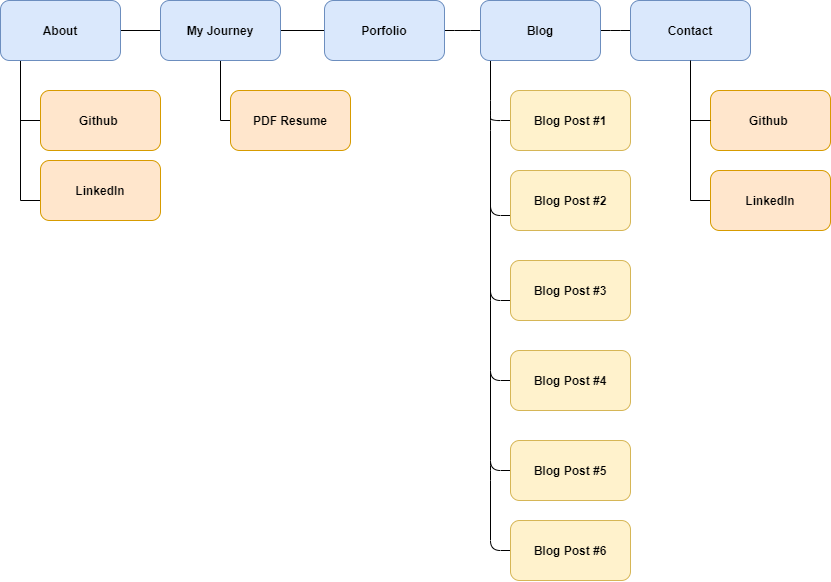
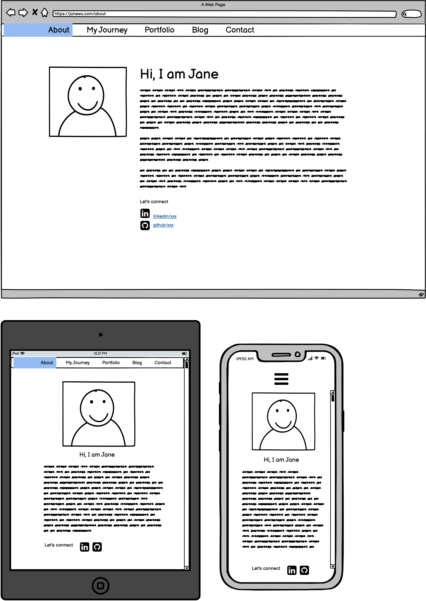
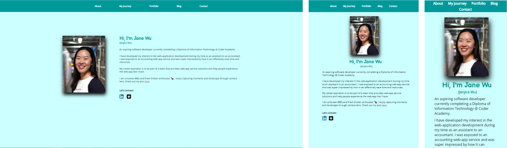
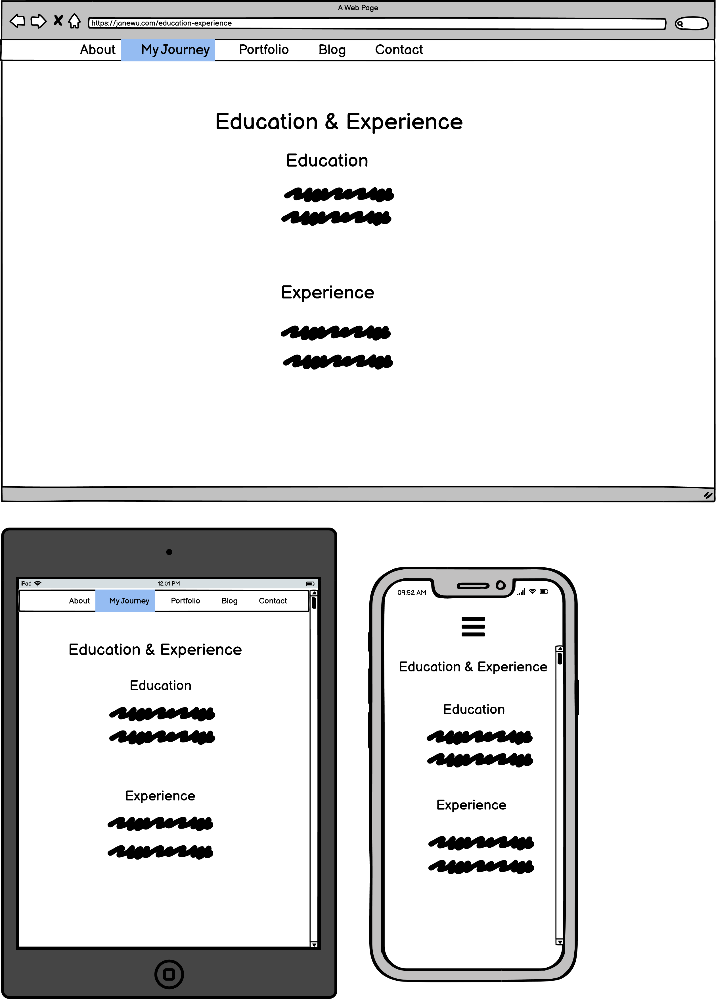
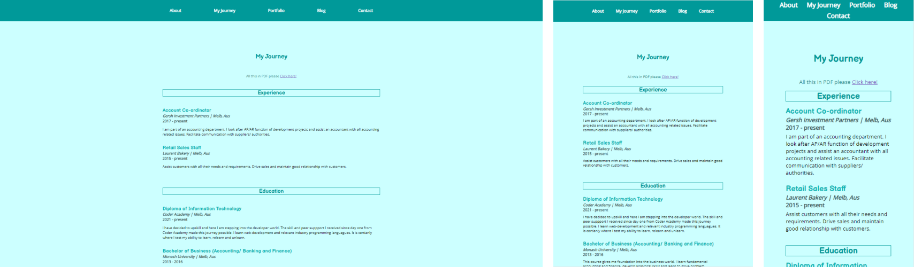
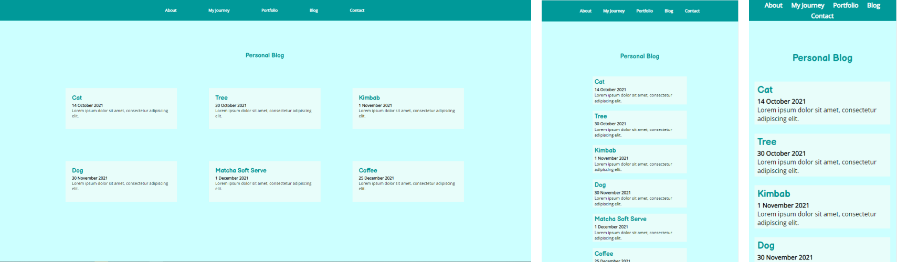
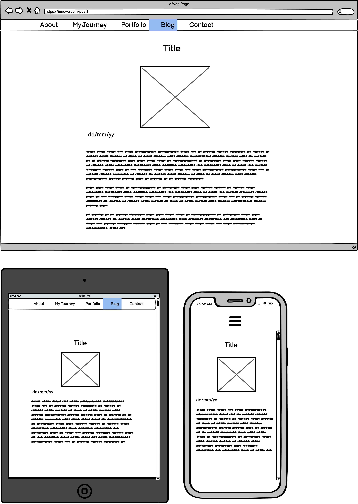
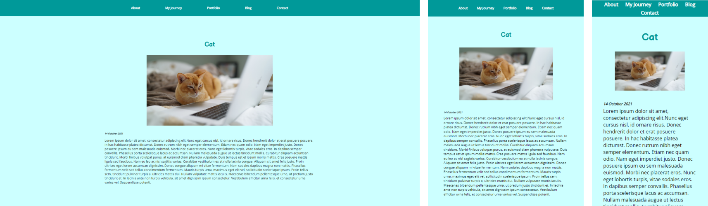
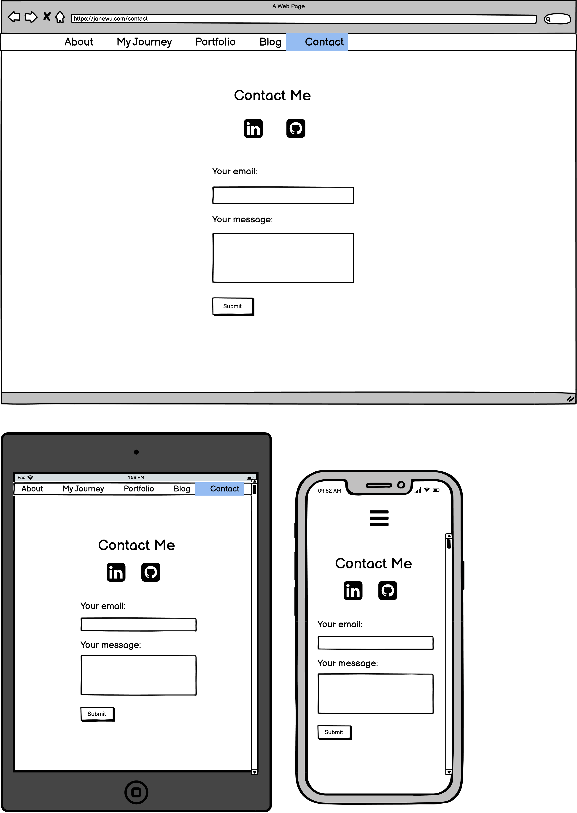
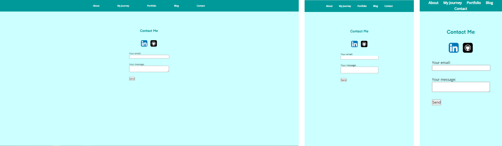

# Jane Wu's Portfolio Website

## URL to the published website

<https://jwujane.netlify.app/>

## URL to GitHub Repo

<https://github.com/jwujane/T1A2>

## Description of the portfolio website

### Purpose

A portfolio website to present myself to the potential IT employer. The website provides an online portfolio, information about me, my skills, interests, professional knowledge.

### Target audience

Employer looking to engage an IT professional/ developer. Hiring manager, Recruiter.

### Tech Stack

HTML, CSS

### Deployment Platform

[Netlify](https://www.netlify.com/)

### Sitemap

### Features

The website consists of 5 main html pages which can be navigated from the navigation bar on the top of each page.

- **About** - contains brief summary of myself, interest, hobby and links to LinkedIn and GitHub.

- **My Journey** - contains Contains list of education and work experience, links to PDF resume.

- **Portfolio** - showcase of works related to web and software development. Currenlty a placeholder.

- **Blog** - contains all blog posts; title of the blog post, date published and brief content of the post.

- **Blog Post** - sits inside Blog page, contains text and graphic content of an individual blog.

- **Contact** - contains links to social accounts and form section for direct messages.

